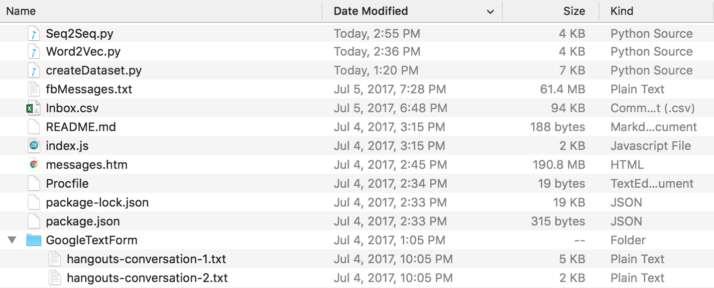
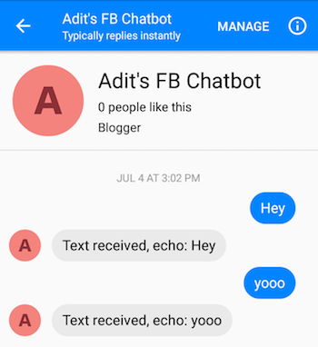

# Facebook-Messenger-Bot

The FB Messenger chatbot that I trained to talk like me. The associated [blog post](). 

## Overview

For this project, I wanted to train a Sequence To Sequence model on my past conversation logs from various social media sites. You can read more about the motivation behind this approach, the details of the ML model, and the purpose of each Python script in the blog post, but I want to use this README to explain how you can train your own chatbot to talk like you. 

## Requirements and Installation
In order to run these scripts, you'll need the following libraries. 

* **[TensorFlow](https://www.tensorflow.org/install/) version 1.0 or later**
* [NumPy](https://docs.scipy.org/doc/numpy/user/install.html)
* [Pandas](https://pandas.pydata.org/pandas-docs/stable/install.html)

## How You Can Train Your Own

1. Download and unzip [this entire repository from GitHub](https://github.com/adeshpande3/Facebook-Messenger-Bot), either interactively, or by entering the following in your Terminal.
    ```bash
    git clone https://github.com/adeshpande3/Facebook-Messenger-Bot
    ```

2. Navigate into the top directory of the repo on your machine
    ```bash
    cd Facebook-Messenger-Bot
    ```
3. Our first job is to download all of your conversation data from various social media sites. For me, I used Facebook, Google Hangouts, and LinkedIn. If you have other sites that you're getting data from, that's fine. You just will have to create a new method in [createDataset.py](https://github.com/adeshpande3/Facebook-Messenger-Bot/blob/master/createDataset.py). 

* Facebook Data: Download your data from [here](https://www.facebook.com/help/131112897028467). Once downloaded, you should have a fairly large file called **messages.htm**. It'll be a pretty large file (over 190 MB for me). We're going to need to parse through this large file, and extract all of the conversations. To do this, we'll use this [tool](https://github.com/ownaginatious/fbchat-archive-parser) that Dillon Dixon has kindly open sourced. You'll clone his repository, and run:
    ```bash
    fbcap ./messages.htm > fbMessages.txt
    ```
This will give you all your Facebook conversations in a fairly unified text file. Thanks Dillon! Go ahead and then store that file in your Facebook-Messenger-Bot folder. 

* LinkedIn Data: Download your data from [here](https://www.linkedin.com/psettings/member-data). Once downloaded, you should see an **inbox.csv** file. We won't need to take any other steps here, we just want to copy it over to our folder. 

* Google Hangouts Data: Download your data form [here](https://takeout.google.com/settings/takeout/custom/chat). Once downloaded, you'll get a JSON file that we'll need to parse through. To do this, we'll use this [parser](https://takeout.google.com/settings/takeout/custom/chat) found through this phenomenal [blog post](https://blog.jay2k1.com/2014/11/10/how-to-export-and-backup-your-google-hangouts-chat-history/). We'll want to save the data into text files, and then copy the folder over to ours. 

At the end of all this, you should have a directory structure that looks like this. Make sure you rename the folders and file names if yours are different. 



4. Now that we have all our conversation logs in a clean format, we can go ahead and create our dataset. In our directory, let's run:
    ```bash
    python createDataset.py
    ```
You'll then be prompted to enter your name (so that the script knows who to look for), and which social media sites you have data for. This script will create a file named **conversationDictionary.npy** which is a Numpy object that contains pairs in the form of (FRIENDS_MESSAGE, YOUR RESPONSE). A file named **ConversationData.txt** will also be created. This is simply a large text file the dictionary data in a unified form. 

5. Now that we have those 2 files, we can start creating our word vectors through a Word2Vec model. 
    ```bash
    python Word2Vec.py
    ```
This will create 4 different files. **Word2VecXTrain.npy** and **Word2VecYTrain.npy** are the training matrices that Word2Vec will use. We save these in our folder, in case we need to train our Word2Vec model again with different hyperparameters. We also save **wordList.txt**, which simply contains all of the unique words in our corpus. The last file saved is **embeddingMatrix.npy**  which is a Numpy matrix that contains all of the generatedword vectors. 

6. Now, we can use the embedding matrix to help us train our Seq2Seq model.
    ```bash
    python Seq2Seq.py
    ```
This will create 2 different files. **Seq2SeqXTrain.npy** and **Seq2SeqYTrain.npy** are the training matrices that Seq2Seq will use. Again, we save these just in case we want to make changes to our model architecture, and we don't want to recompute our training set. The last file will be a .ckpt file which holds our saved Seq2Seq model. This will be used once we've created our chatbot. 

7. Now that we have a saved model, let's now create our Facebook chatbot. To do so, I'd recommend following this [tutorial](https://github.com/jw84/messenger-bot-tutorial). You don't need to read anything beneath the "Customize what the bot says" section. Our Seq2Seq model will handle that part. **IMPORTANT - The tutorial will tell you to create a new folder where the Node project will lie. Keep in mind this folder will be different from our folder (We'll be moving files later).** The tutorial itself should be sufficient, but here's a summary of the steps. 

    - Build the server, and host on Heroku. 
    - Create a Facebook App/Page, set up the webhook, get page token, and trigger the app. 
    - Add an API endpoint to **index.js** so that the bot can respond with messages. 

After following the steps correctly, you should be able to message the chatbot, and get responses back. 



8. Ah, you're almost done! Now, we just have to edit the index.js file located in your Node project folder (The folder you created in the tutorial). You can just copy this [index.js](https://github.com/adeshpande3/Facebook-Messenger-Bot/blob/master/index.js) file over, and overwrite. This updated code will load the model into our server code, feed all of the bot's received messages into the model, and render the model's output back to the user. 

There ya go. You should be able to send messages to the chatbot, and see some interesting responses that (hopefully) resemble yourelf in some way

## This Chabot is Too Cool 

insert screenshots of chabot responding well 

## Well This is Awk

insert screenshots of chabot responding poorly 